# Github PR 보내는 법

## 1. Fork
### 1.1. 오른쪽 상단 Fork 버튼 클릭
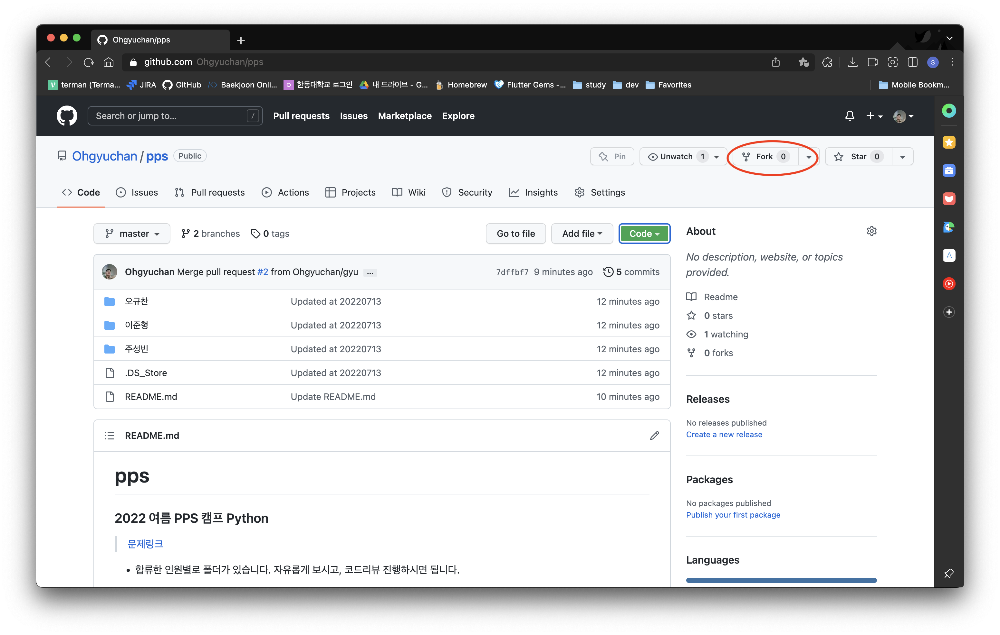

### 1.2. Create Fork
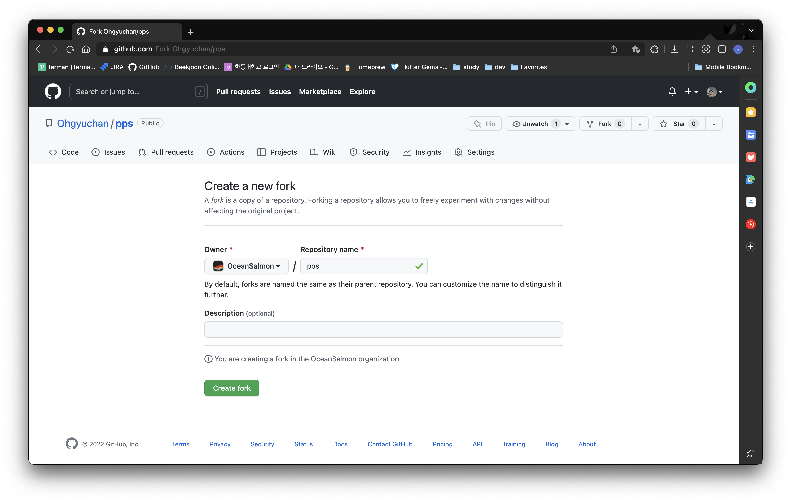
* 아래 사진처럼 본인의 깃헙에 포크한 레포지토리가 생성된 것을 확인할 수 있을 겁니다.
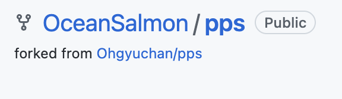

## 2. 내 코드 추가하기
> 두 가지 방법이 있습니다.  
> 1. git clone 명령어로 로컬에서 수정하기
> 2. github으로 파일 추가하기  
> 1번은 인터넷에서 익히셔서 하시길 권장합니다.  
> 본 포스터에서는 2번에 대한 내용만 소개하겠습니다.

### 2.1. Create new file
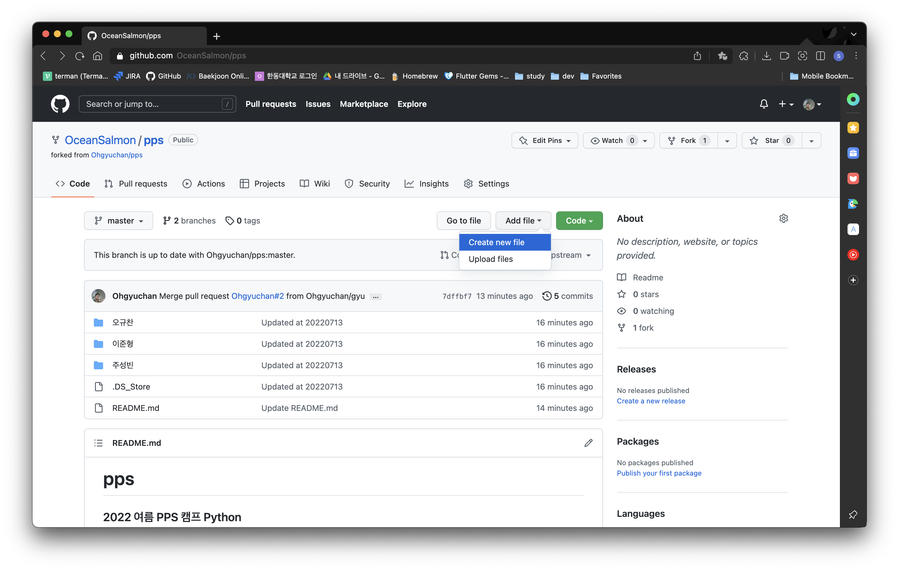

### 2.2. Create new directory
> 파일명으로 자신의 이름을 먼저 쓰고 `/`을 쓰면 해당 이름이 폴더 이름이 됩니다.  
> ex. `이름/`  
> 본인의 코드를 Copy & Paste 하시면 되고, 한 번 본인 이름으로 된 폴더 생성 후에는 해당 레포지토리에서 코드 파일을 `Upload`하면 됩니다.  

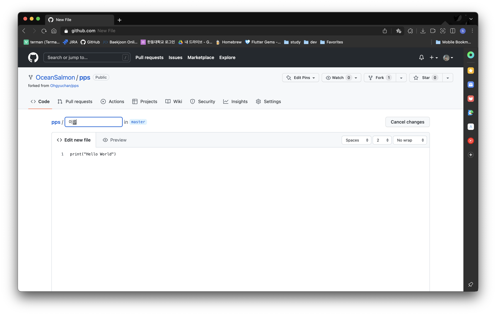

### 2.3. 코드 Copy & Paste
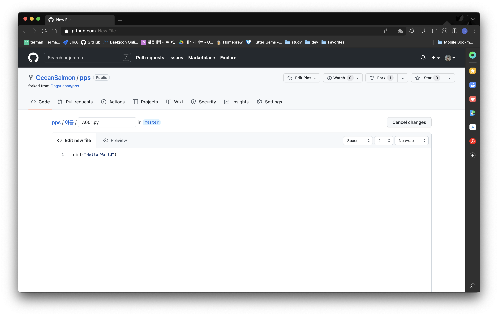

## 3. Create Pull Request
### 3.1. Pull Request 만들기
1. 코드 추가 후 `Contribute` 를 누른다.
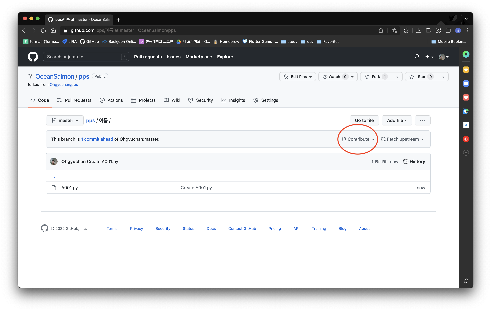
2. `Create pull request` 버튼 클릭
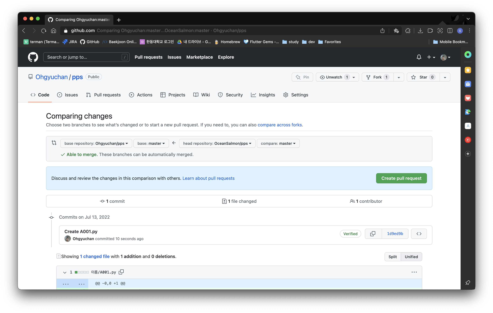
3. PR title, body 입력 후 `Create pull request` 버튼 클릭
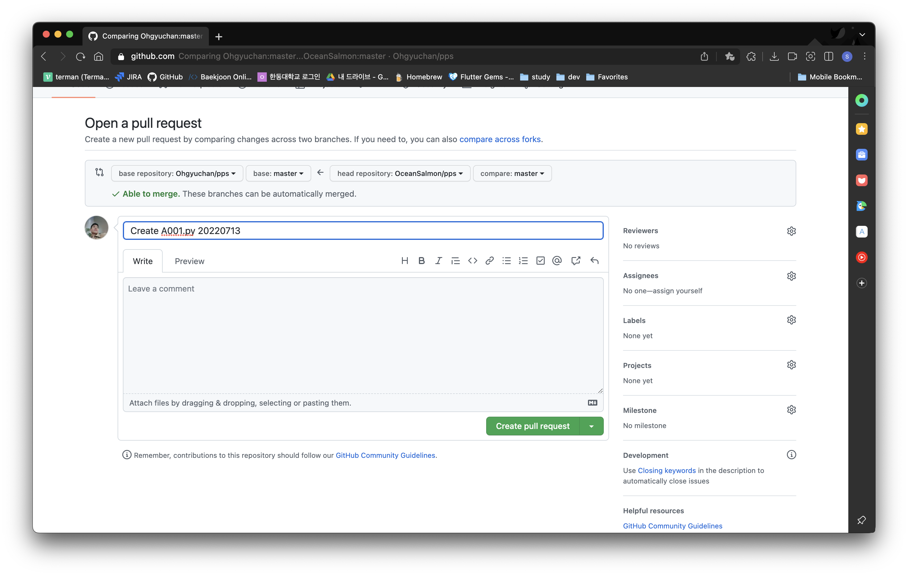
4. 원본 Repository에 PR이 생성된 모습
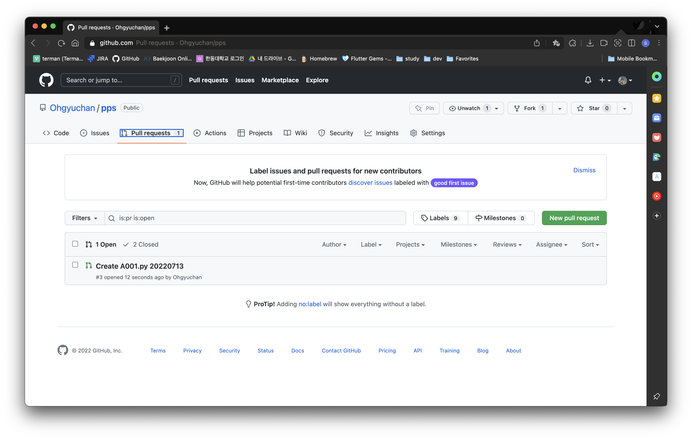
5. 원본 레포지토리 소유자가 PR을 merge한 모습
> 원본 레포지토리에 PR 보낸 내용이 추가된 모습을 볼 수 있습니다.

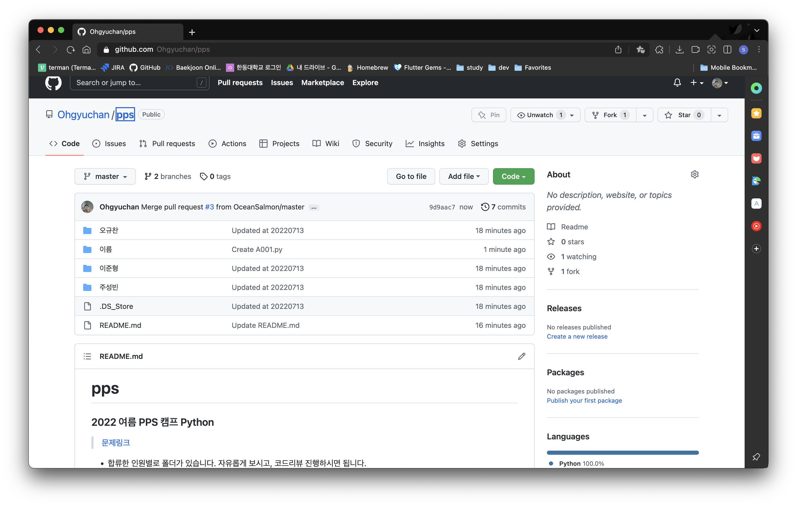

## 4. Fetch
### 4.1. 원본 레포지토리의 수정사항을 내가 Fork한 레포지토리에 업데이트하기
1. Fetch upstream을 누른다.
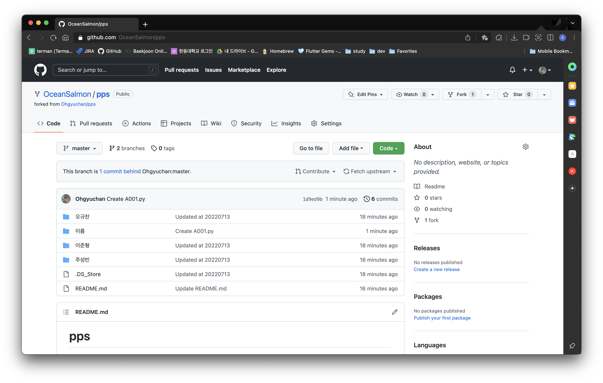
2. Fetch and merge를 누른다.
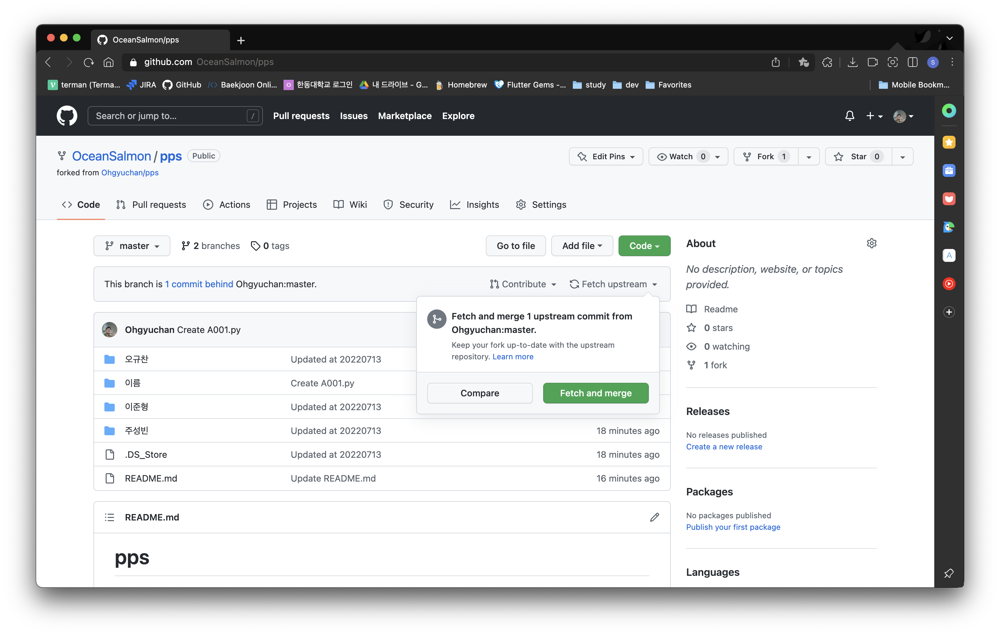
3. 내가 Fork한 레포지토리가 원본 레포지토리의 최신 버전으로 업데이트 된 모습
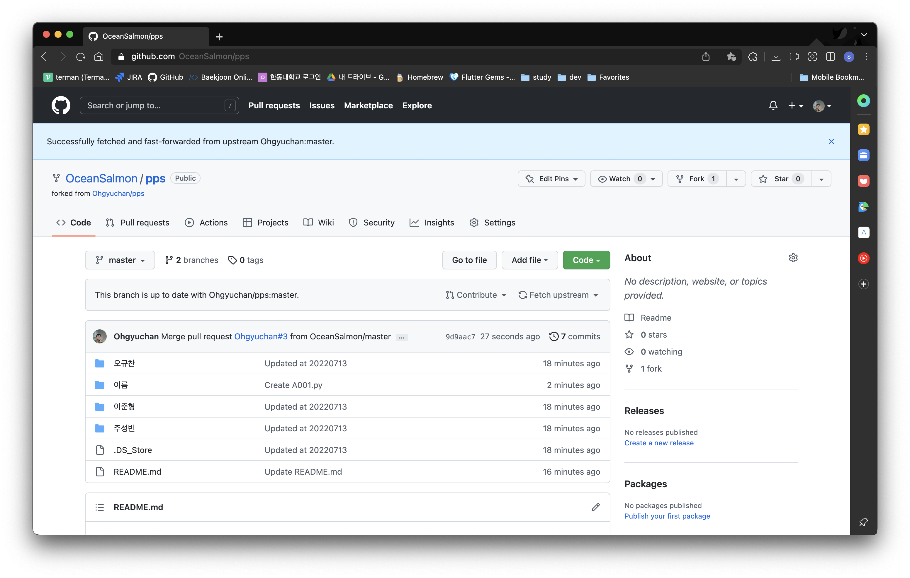

